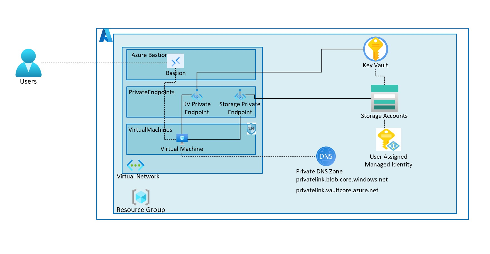

# Introduction to using Azure Verified Modules for Terraform

This is a lab based sample that demonstrates how to use the Azure Verified Modules for Terraform. The repository contains the full working solution, but you should follow the steps in the lab to understand how it fits together.

## Content

| File/folder | Description |
|-------------|-------------|
| `labs` | The files for the lab. |
| `.gitignore` | Define what to ignore at commit time. |
| `CHANGELOG.md` | List of changes to the sample. |
| `CONTRIBUTING.md` | Guidelines for contributing to the sample. |
| `README.md` | This README file. |
| `LICENSE.md` | The license for the sample. |

## Features

This sample deploys the following features:

* Virtual network
* Subnets
* Network security groups
* Virtual machines
* Azure Bastion Host
* Managed identities
* Key Vault
* Storage account with customer managed key
* Private end points and associated private DNS zones



## Getting Started

### Prerequisites

* HashiCorp Terraform CLI Version 1.10 or higher: [Download](https://www.terraform.io/downloads)
* Git: [Download](https://git-scm.com/downloads)
* Visual Studio Code: [Download](https://code.visualstudio.com/)
  * Azure Terraform Extension for Visual Studio Code: [Install](https://marketplace.visualstudio.com/items?itemName=ms-azuretools.vscode-azureterraform)
  * HashiCorp Terraform Extension for Visual Studio Code: [Install](https://marketplace.visualstudio.com/items?itemName=HashiCorp.terraform)
* Azure CLI: [Download](https://learn.microsoft.com/en-us/cli/azure/install-azure-cli-windows?tabs=azure-cli#install-or-update)
* An Azure Subscription: [Free Account](https://azure.microsoft.com/en-gb/free/search/)

### Quickstart

The instructions for this sample are in the form of a Lab. Follow along with them to get up and running.

## Demo / Lab

### Part 0 - Get the lab files and login to Azure

In this part we are going to get a local copy of the lab files for use in the rest of the lab.

1. Create a new root folder for the lab in a location of your choice.
1. Open a terminal and navigate to the new folder.
1. Run `git clone https://github.com/Azure-Samples/avm-terraform-labs` to clone the lab files into the new folder, they will be in a subfolder called `avm-terraform-labs`.

      ```pwsh
      git clone https://github.com/Azure-Samples/avm-terraform-labs
      mkdir avm-lab
      ```

      Your file structure should now look like this:

      ```plaintext
      📂my-lab-folder
      ┣ 📂avm-lab
      ┗ 📂avm-terraform-labs
      ```

1. Open Visual Studio Code.

      ```pwsh
      code .
      ```

1. Open the VSCode Terminal and navigate to the `avm-lab` folder.

      ```pwsh
      cd avm-lab
      ```

1. Run `az login` to login to your Azure subscription.
1. Run `az account show` to show the current subscription. Run `az account set --subscription <subscription-id>` to set the subscription if it is not the one you want to use.
1. Set your subscription ID environment variable with `$env:ARM_SUBSCRIPTION_ID = $(az account show --query id -o tsv)`. This is required by the `azurerm` provider since v4.

### Part 1 - Base files and resources

In this part we are going to setup our Terraform root module and deploy an Azure Resource Group and Log Analytics Workspace ready for the rest of the lab. In this part we introduce out first Azure Verified Module, the `avm-res-log-analytics-workspace` module.

The Log Analytics Workspace is used as the target for diagnostic settings for all our other resources. This is where we are sending our logging telemetry.

1. Copy the files from the [part 1](labs/part01-base/) folder into the `avm-lab` folder.

      ```pwsh
      copy ../avm-terraform-labs/labs/part01-base/* .
      ```

      Your file structure should look like this:

      ```plaintext
      📂my-lab-folder
      ┣ 📂avm-lab
      ┃ ┣ 📜.gitignore
      ┃ ┣ 📜avm.log_analytics_workspace.tf
      ┃ ┣ 📜locals.tf
      ┃ ┣ 📜main.tf
      ┃ ┣ 📜outputs.tf
      ┃ ┣ 📜terraform.tf
      ┃ ┗ 📜variables.tf
      ┗ 📂avm-terraform-labs
      ```

1. Examine the `terraform` block in `terraform.tf` and note that we are referencing the `azurerm` and `random` providers.
1. Examine the `locals.tf`, `variables.tf`, `outputs.tf` and `main.tf` files.
1. Examine the `avm.log_analytics_workspace.tf` file and note the `source` and `version` properties.
1. Create an environment variable to set the location variable:

      ```pwsh
      $env:TF_VAR_location = "<azure region>"
      ```

      Replace `<azure region>` with a valid Azure location of your choice (e.g. uksouth).

      ```pwsh
      $env:TF_VAR_location = "uksouth"
      ```

      > IMPORTANT: If you are following this lab in Skillable, the region must be set to `uksouth` or you'll get a policy error.

1. Create a file called `terraform.tfvars` and add the following code to it:

      ```hcl
      tags = {
        type = "avm"
        env  = "demo"
      }
      ```

1. Run `terraform init` to initialize the Terraform configuration.
1. Run `terraform plan -out tfplan` to see what resources will be created and create a plan file.
1. Run `terraform apply tfplan` to create the resources based on the plan file.
1. If your run is successful, you will see:

      ```plaintext
      Apply complete! Resources: 6 added, 0 changed, 0 destroyed.
      ```

1. Take note of the outputs from the `terraform apply` command, they should look like this:

      ```plaintext
      Outputs:

      resource_ids = {
        "log_analytics_workspace" = "/subscriptions/b857908d-3f5c-4477-91c1-0fbd08df4e88/resourceGroups/rg-demo-dev-uksouth-001/providers/Microsoft.OperationalInsights/workspaces/law-demo-dev-uksouth-001"
        "resource_group" = "/subscriptions/b857908d-3f5c-4477-91c1-0fbd08df4e88/resourceGroups/rg-demo-dev-uksouth-001"
      }
      resource_names = {
        "log_analytics_workspace_name" = "law-demo-dev-uksouth-001"
        "resource_group_name" = "rg-demo-dev-uksouth-001"
      }
      ```

1. Navigate to the Azure Portal and review the resources that have been created.
1. Run `git init -b main` to initialize a new git repository.
1. Run `git add .` to stage the files.
1. Run `git commit -m "Initial commit"` to commit the files.
1. If you are prompted to set up a git Author identity, follow the instructions and then re-run the `git commit` command.

    ```pwsh
    git config --global user.email "first.last@domain.com"
    git config --global user.name "First Last"
    ```

### Part 2 - Virtual network and subnets

In this part we are going to add a virtual network and subnets to our Terraform configuration by leveraging the Azure Verified Module for Virtual Network. The Virtual Network is going to be used to provide private connectivity between and to our virtual machine, key vault and storage account.

>IMPORTANT: This lab is incremental, you must not delete any files from the previous lab (especially the `terraform.tfstate` file). You must copy the files from the next lab into the `avm-lab` folder and only replace the existing files when prompted.

1. Copy the files from the [part 2](labs/part02-vnet/) folder into the `avm-lab` folder. This will add some new files and replace some files.

      ```pwsh
      copy ../avm-terraform-labs/labs/part02-virtual-network/* .
      ```

      Your file structure should now look like this if you have followed the instructions correctly (this structure will continue to grow as you progress through the lab):

      ```plaintext
      📂my-lab-folder
      ┣ 📂avm-lab
      ┃ ┣ 📂.git (hidden)
      ┃ ┣ 📂.terraform
      ┃ ┣ 📜.gitignore
      ┃ ┣ 📜.terraform.lock.hcl
      ┃ ┣ 📜avm.log_analytics_workspace.tf
      ┃ ┣ 📜avm.nat_gateway.tf
      ┃ ┣ 📜avm.network_security_group.tf
      ┃ ┣ 📜avm.virtual_network.tf
      ┃ ┣ 📜locals.tf
      ┃ ┣ 📜main.tf
      ┃ ┣ 📜outputs.tf
      ┃ ┣ 📜terraform.tf
      ┃ ┣ 📜terraform.tfstate
      ┃ ┣ 📜terraform.tfvars
      ┃ ┣ 📜tfplan
      ┃ ┗ 📜variables.tf
      ┗ 📂avm-terraform-labs
      ```

1. Open your `terraform.tfvars` and update it with the following code:

      ```hcl
      address_space = "10.0.0.0/22"
      subnets = {
        AzureBastionSubnet = {
          size                       = 26
          has_nat_gateway            = false
          has_network_security_group = false
        }
        private_endpoints = {
          size                       = 28
          has_nat_gateway            = false
          has_network_security_group = true
        }
        virtual_machines = {
          size                       = 24
          has_nat_gateway            = true
          has_network_security_group = false
        }
      }
      tags = {
        type = "avm"
        env  = "demo"
      }
      ```

1. Run `terraform init` to install the AVM module for Virtual Networks.
1. Navigate to the `Source Control` tab in Visual Studio Code and review the changes to the files.
1. Open the `avm.ip_addresses.tf` file and look at note the use of a utility module here, pay close attention to the `source` and `version` properties. A utility module is a helper module that doesn't deploy anything itself, but is used to calculate common values.
1. Open the `avm.virtual-network.tf` file and look at each of the properties, paying close attention to the `source` and `version` properties.
1. Examine the diagnostics settings in `locals.tf` and take note that this same setting will be applied to all of the AVM modules in the lab.
1. In order to find more detail about AVM modules, you can navigate to their documentation. For example, you can find the documentation for the Virtual Network module [here](https://registry.terraform.io/modules/Azure/avm-res-network-virtualnetwork/azurerm/latest). From there you can navigate to the source code and see the module's implementation [here](https://github.com/Azure/terraform-azurerm-avm-res-network-virtualnetwork).
1. Apply the changes with Terraform: `terraform apply -auto-approve`.
1. Review the deployed resources in the Azure Portal.
1. Commit the changes to git: `git add . && git commit -m "Add virtual network and subnets"`.

### Part 3 - Key Vault

In this part we are going to add a Key Vault to our Terraform configuration by leveraging the Azure Verified Module for Key Vault. The Key Vault is going to be used to store the customer managed key for our storage account and the SSH private key for our virtual machine.

1. Copy the files from the [part 3](labs/part03-keyvault/) folder into the `avm-lab` folder, remembering to retain the existing files and just add and overwrite when prompted.

      ```pwsh
      copy ../avm-terraform-labs/labs/part03-key-vault/* .
      ```

1. Run `terraform init` to install the AVM module for Key Vault.
1. Navigate to the `Source Control` tab in Visual Studio Code and review the changes to the files.
1. Open the `avm.key-vault.tf` file and look at each of the properties, paying close attention to the `private_endpoints` and `role_assignments` variables.
1. Apply the changes with Terraform: `terraform apply -auto-approve`.
1. Review the deployed resources in the Azure Portal.
1. Commit the changes to git: `git add . && git commit -m "Add key vault"`.

### Part 4 - Storage account

In this part we are going to add a Storage Account to our Terraform configuration by leveraging the Azure Verified Module for Storage Account. The Storage Account is the main component of our demo lab and we will interact with it later on.

1. Copy the files from the [part 4](labs/part04-storage-account/) folder into the `avm-lab` folder, remembering to retain the existing files and just add and overwrite when prompted.

      ```pwsh
      copy ../avm-terraform-labs/labs/part04-storage-account/* .
      ```

1. Run `terraform init` to install the AVM module for Storage Account.
1. Navigate to the `Source Control` tab in Visual Studio Code and review the changes to the files.
1. Open the `avm.storage-account.tf` file and look at each of the properties, paying close attention to the `managed_identities`, `customer_managed_key` and `containers` variables.
1. Note in the source control diff that we are adding a key to the Key Vault using the AVM module and assigning permissions for the user assigned managed identity to access the key.
1. Apply the changes with Terraform: `terraform apply -auto-approve`.
1. Review the deployed resources in the Azure Portal.
1. Commit the changes to git: `git add . && git commit -m "Add storage account"`.

### Part 5 - Virtual machine and Bastion

In this part we are going to add a Virtual Machine to our Terraform configuration by leveraging the Azure Verified Module for Virtual Machine. The Virtual Machine is going to be used to interact with the Storage Account later. We are also going to add a role assignment to the storage module to assign permissions to the managed identity of the virtual machine to the storage container.

1. Copy the files from the [part 5](labs/part05-vm/) folder into the `avm-lab` folder, remembering to retain the existing files and just add an overwrite when prompted.

      ```pwsh
      copy ../avm-terraform-labs/labs/part05-virtual-machine/* .
      ```

1. Run `terraform init` to install the AVM modules for Virtual Machine and Role Assignments.
1. Apply the changes with Terraform. NOTE: We are applying this now, because the bastion can take a few minutes to deploy.
1. Navigate to the `Source Control` tab in Visual Studio Code and review the changes to the files.
1. Open the `avm.virtual-machine.tf` file and look at each of the properties, paying close attention to the `generated_secrets_key_vault_secret_config` and `network_interfaces` variables.
1. Apply the changes with Terraform: `terraform apply -auto-approve`.
1. Review the deployed resources in the Azure Portal.
1. Commit the changes to git: `git add . && git commit -m "Add virtual machine and bastion"`.

### Part 6 - Connect to the VM via Bastion

In this part we are going to connect to the virtual machine via the Azure Bastion service using the SSH private key stored in the Key Vault.

1. Open the Azure Portal and navigate to the VM.
1. Click on the `Connect` button and select `Bastion`.
1. Choose `SSH Private Key from Azure Key Vault` in the `Authentication Type` dropdown.
1. Enter `azureuser` in the `Username` field.
1. Select you subscription from the `Subscription` drop down.
1. Select the Key Vault you created in the lab in the `Azure Key Vault` drop down.
1. Select the secret you created in the lab in the `Azure Key Vault Secret` drop down.
1. Click `Connect`. You may see a pop-up blocked message, click on the pop-up blocked icon in the address bar and select `Always allow pop-ups and redirects from https://portal.azure.com`.
1. A new browser window will open with a terminal session to the VM.

### Part 7 - Install the Azure CLI and login

We are going to install the Azure CLI and login with the system assigned managed identity of the VM from the Azure Bastion SSH terminal.

1. Run `curl -sL https://aka.ms/InstallAzureCLIDeb | sudo bash` to install the Azure CLI.
1. Run `az login --identity` to login with the system assigned managed identity.

### Part 8 - Create a blob in the storage account

We are going to create a blob in the storage account using the Azure CLI form the Azure Bastion SSH terminal.

1. Run `echo "hello world" > hello.txt` to create a file with some content.
1. Run `az storage blob upload --account-name <storage-account-name> --container-name demo --file hello.txt --name hello.txt --auth-mode login` to upload the file to the storage account.
1. Run `az storage blob list --account-name <storage-account-name> --container-name demo --auth-mode login` to list the blobs in the container.
1. Run `az storage blob download --account-name <storage-account-name> --container-name demo --name hello.txt --file hello2.txt --auth-mode login` to download the blob to a new file.
1. Run `cat hello2.txt` to view the contents of the downloaded file.

      Here are the commands to run, so you can copy to notepad and replace the placeholder with the storage account name you created in the lab. Then run the commands in the terminal:

      ```bash
      echo "hello world" > hello.txt
      az storage blob upload --account-name replace_me --container-name demo --file hello.txt --name hello.txt --auth-mode login
      az storage blob list --account-name replace_me --container-name demo --auth-mode login
      az storage blob download --account-name replace_me --container-name demo --name hello.txt --file hello2.txt --auth-mode login
      cat hello2.txt
      ```

### Clean up

Finally we will clean up everything we have created in the lab.

1. Run `terraform destroy` from the Visual Studio Code terminal to remove the resources created by Terraform.
1. When prompted type `yes` and press `Enter` to confirm the destruction.

## Resources

* AVM Documentation: [Azure Verified Modules](https://aka.ms/avm)
